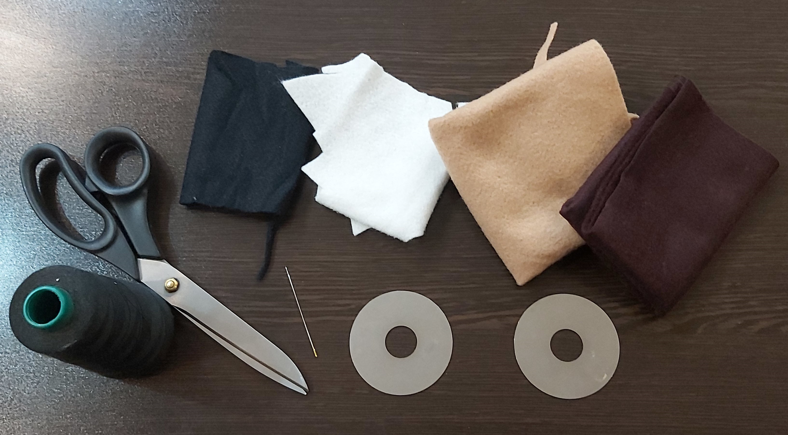

## This is a simple idea for reusing your old hard disk!
What you need:
- An old hard disk
- Some felt (The color is optional)
- Some yarn
- A niddle
- scissors 
- Some colorful beads

## First open the hard drive with a screwdriver 

---

## Choose a particular color of felt...I chose brown!

---

## Cut your felt in the shape of a donut...notice that your felt should cover the whole disk 

---

## Then make the chocolate layer...the curves makes it more natural

---

## At last sew the beads to the chocolate layer to make it look like sprinkles!
## Your donut is ready!

---